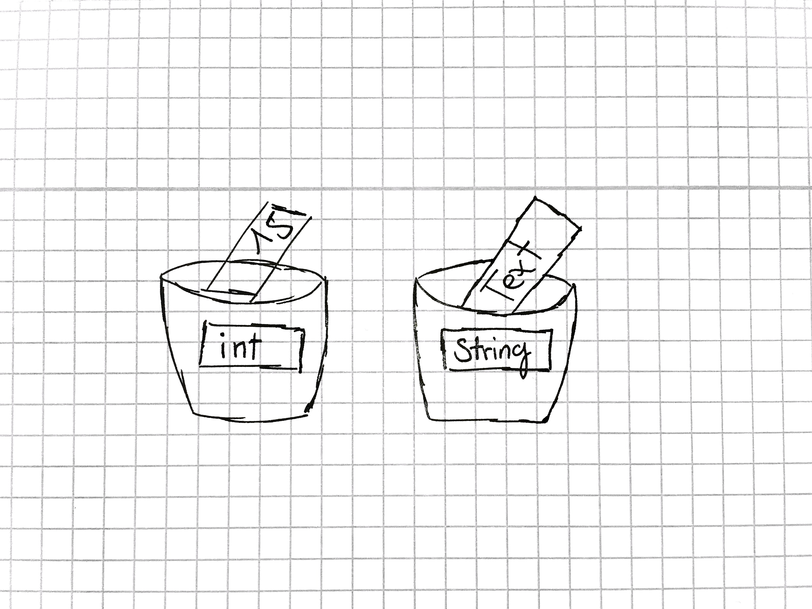

# Variablen und Datentypen

Wieso Variablen?

Manchmal müssen wir den selben Wert, z.B. eine Zahl an mehreren Stellen einsetzen. Dann wäre es ja super geschickt, wenn wir alle Zahlen auf einmal ändern könnten.


```
//Wiederholung

class Variablen
{
  public static void main(String[] args)
  {
    int ganzeZahl = 15;
    float kommaZahl = 1.8;
    String meinText = "Ich bin eine Zeichenkette.";
    boolean wahrOderFalsch = true;
  }
}
```

Wir können uns Variablen wie Töpfe vorstellen in die wir einen kleinen Zettel hineinwerfen können. Jeder Topf hat ein Schild auf dem steht was auf den Zetteln stehen darf. Diese Schilder würden wir in der Informatik **Datentypen** nennen.




## Primitive Datentypen (Einfache Datentypen)

### Ganze Zahlen
Typ|Größe
-|-
byte|1 Byte (8bit)
short|2 Byte (16bit)
int|4 Byte (32bit)
long|8 Byte (64bit)

### Fließkommazahlen / Kommazahlen
Typ|Größe
-|-
float|4 Byte (32bit)
double|8 Byte (64bit)

```
//Beispiele
class Variablen
{
  public static void main(String[] args)
  {
    //Ganze Zahlen
    byte byteVariable = 127;  // 1 Byte
    short shortVariable = 1000;  // 2 Byte
    int integerVariable = 15;  // 4 Byte
    long longVariabel = 42;  // 8 Byte
    //Kommazahlen
    float kommaZahl = 1.8;  // 4 Byte
    double kommaZahlMitDoppelterPräzision = 1.9;  // 8 Byte
  }
}
```

### Weiter Datentypen

Typ|Größe
-|-
boolean|1 bit
char|8bit oder 16bit (8bit oder 16bit Unicode)

```
//Beispiele
class Variablen
{
  public static void main(String[] args)
  {
    boolean wahrOderFalsch = true;
    boolean kannAuchZahlSein = 1; // kann 0 oder 1 sein
    char buchstabe = 'a';
  }
}
```

### Strings

Vielleicht ist euch schon einmal aufgefallen, dass `String` groß geschrieben wird wenn ihr eine neue Textvariable macht.

Das hat einen Grund: Strings sind anders. Strings sind keine einfachen Datentypen sondern **Objekte**. Das hat für euch zuerst einmal nur sehr wenige Auswirkungen.

```
//Beispiele
class Variablen
{
  public static void main(String[] args)
  {
    String meinText = "Text";
    String zweiterText = "Text";

    boolean gleicherString = meinText == zweiterText;
  }
}
```
Wieso funktioniert das nicht?

Wir vergleichen zwei **Objekte** miteinander. Wir müssen den Inhalt, die Zeichenkette, miteinander vergleichen.

```
class Variablen
{
  public static void main(String[] args)
  {
    String meinText = "Text";
    String zweiterText = "Text";

    boolean gleicherString = meinText.equals(zweiterText);
  }
}
```

Was können wir noch für coole Sachen mit Strings machen?

Dadurch das Strings Objekte sind, können wir schreiben:

`int textlaenge = meinText.length(); // textleange = 4`

Oder wir können uns einen Teil des Textes geben lassen, z.B. die Zeichen 5-10:

`String zeichen5Bis10 = meinText.subString(4,9); // wir fangen bei 0 an zu zählen!`

Wir rufen Methoden auf diesen Objekten auf. Wie genau das funktioniert und wie ihr sowas selber schreiben könnt, lernen wir später.

[Hier](https://docs.oracle.com/javase/7/docs/api/java/lang/String.html) gibt es ganz viele Methoden die ihr auf einem String aufrufen könnt. (Immer mit dem Punkt dazwischen (Rückgabetyp beachten!!))

## Unterschied deklarieren und initialisieren

```
class Variablen
{
  public static void main(String[] args)
  {
    //deklarieren (bekannt machen)
    String meinText;
    int meineZahl;

    //initialisieren (einen Wert zuweisen)
    meinText = "text";
    meineZahl = 3;

    //deklarieren und initliasieren zusammen
    String meinText = "text";
    int meineZahl = 3;
  }
}
```
